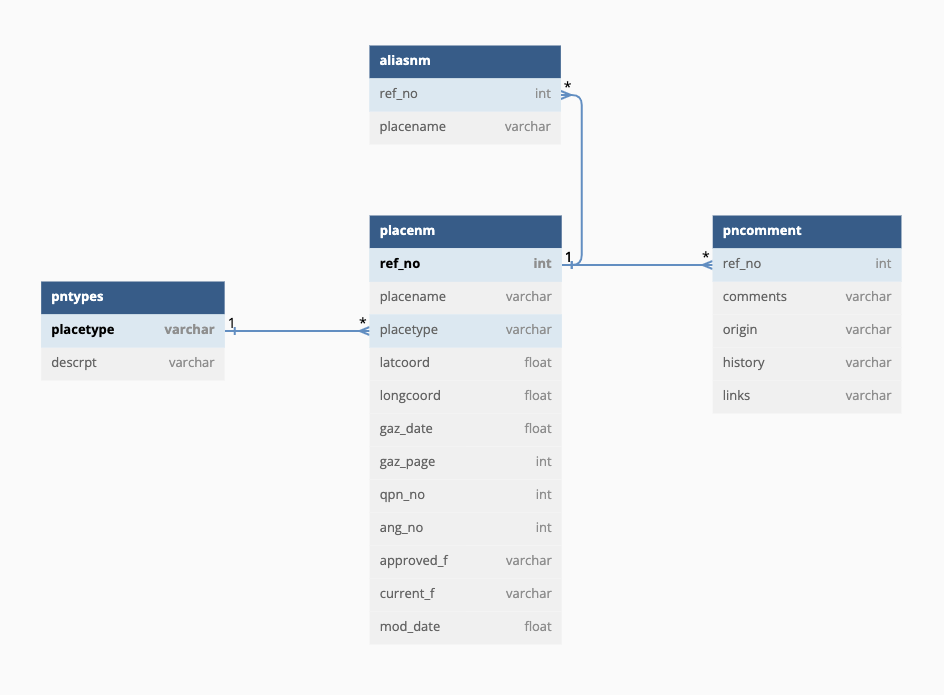

# Running the ETL

The ETL created from 2023 in the CAM1 project used pyspark where the entire table was loaded into memory and distributed to workers. In the CAM3 2024 project, data is now loaded into a local `lalfdb` postgres database in the default `public` schema, and pyspark is no longer used. Rather than dealing with the complexities of pyspark and the overhead of setting up the Java dependency, python multiprocessing and the psycopg library with server-side cursor is used instead. This allows for better performance, less overhead and easier memory pressure management.

## Scope

The primary purpose of the target system is to manage the names of spatial objects. This includes addresses, geographical names, road names, etc.

These name objects are the primary objects in the system. Secondary objects are the spatial objects it is names for. It must contain the spatial reference identifier and its class type using either an RDF class and/or a geographical object category type. The metadata on these secondary spatial objects is minimal since these objects are managed authoritatively in the spatial system. The spatial objects here are just a copy to facilitate in connecting relationships and ease of querying. These spatial objects must be synced via the message oriented middleware where the spatial system emits events to notify dependent systems such as this to update its spatial object references.

## Setting things up

Start the postgres database service.

```sh
task postgres:up
```

Create the `lalfdb` database via `psql` by running the following commands in the postgres container.

```sh
docker exec -i cam-etl-postgres-1 psql -d postgres -c "CREATE DATABASE lalfdb;" -U postgres -w
docker exec -i cam-etl-postgres-1 psql -d lalfdb -c "CREATE EXTENSION postgis;" -U postgres -w
```

## QRT - Queensland Roads and Tracks

Download QRT v2, a new dataset schema created by Anne Goldsack from [R-SI CAM Project Board > General > Stage 3 - Location Addressing Rollout > Legacy DB exports](https://itpqld.sharepoint.com.mcas.ms/sites/R-SICAMProjectBoard/Shared%20Documents/Forms/AllItems.aspx?id=%2Fsites%2FR%2DSICAMProjectBoard%2FShared%20Documents%2FGeneral%2FStage%203%20%2D%20Location%20Addressing%20Rollout%2FLegacy%20DB%20exports&viewid=d8225c45%2D5e3a%2D4dda%2Db296%2Db01e4ae1eb77).

Use a postgres client to load the flat QRT CSV file into the `lalfdb` database into the `qrt` table. Map all columns to the `text` data type.

To run the ETL, run the following command.

```sh
task etl:db:qrt
```

### Mapping between LALF Roads and QRT

- Map road name and locality from LALF to QRT.
- There's an existing mapping process in FME already. Dig out this logic and implement the same here.
- Road types with `xxx` should not be brought over. See if there are any other road types that should not be brought over.

To be able to get some of the roads data from the LALF and join it together with QRT, we need to add a `qrt_road_name_basic` with values concatenating from `lf_road`'s `road_name` and `lf_road_name_type.road_name_type`.

```sql
ALTER TABLE "lalfpdba.lf_road"
    ADD COLUMN qrt_road_name_basic text;

UPDATE
	"lalfpdba.lf_road" r
SET
	qrt_road_name_basic = r.road_name || ' ' || rnt.road_name_type
FROM "lalfpdba.lf_road_name_type" rnt
WHERE rnt.road_name_type_code = r.road_name_type_code;
```

We also need to align the locality values in QRT and the LALF's locality table. To do this, convert the QRT's `locality_left` column's value to an uppercase and insert it into a new column named `lalf_locality`.

```sql
ALTER TABLE qrt
	ADD COLUMN lalf_locality text;

UPDATE
	qrt q
SET
	lalf_locality = UPPER(q.locality_left);
```

## Place Names Database

The Place Names Database contains both gazetted and non-gazetted place names.

Download the Place Names Database from [R-SI CAM Project Board > General > Stage 3 - Location Addressing Rollout > Legacy DB exports](https://itpqld.sharepoint.com.mcas.ms/sites/R-SICAMProjectBoard/Shared%20Documents/Forms/AllItems.aspx?id=%2Fsites%2FR%2DSICAMProjectBoard%2FShared%20Documents%2FGeneral%2FStage%203%20%2D%20Location%20Addressing%20Rollout%2FLegacy%20DB%20exports&viewid=d8225c45%2D5e3a%2D4dda%2Db296%2Db01e4ae1eb77).

Use a postgres client to load the PNDB CSV files into the `lalfdb` database. Map the CSV file to the following table names with columns mapped to the `text` data type.

- `Tags.csv` -> `pndb.tags`
- `Place name.csv` -> `pndb.place_name`
- `Indigenous name.csv` -> `pndb.indigenous_name`
- `History.csv` -> `pndb.history`

The `pndb.place_name.type_resolved` column maps to the [Geographical Names Categories vocabulary](https://github.com/geological-survey-of-queensland/vocabularies/blob/b07763c87f2f872133197e6fb0eb911de85879c6/vocabularies-qsi/go-categories.ttl).

To run the ETL, run the following command.

```sh
task etl:db:pndb
```

## LALF

The LALF is the Ingress Queensland addressing database. It contains tables that are necessary to form a valid Queensland address object.

Download the LALF from [R-SI CAM Project Board > General > Stage 3 - Location Addressing Rollout > Legacy DB exports](https://itpqld.sharepoint.com.mcas.ms/sites/R-SICAMProjectBoard/Shared%20Documents/Forms/AllItems.aspx?id=%2Fsites%2FR%2DSICAMProjectBoard%2FShared%20Documents%2FGeneral%2FStage%203%20%2D%20Location%20Addressing%20Rollout%2FLegacy%20DB%20exports&viewid=d8225c45%2D5e3a%2D4dda%2Db296%2Db01e4ae1eb77).

The following files contain null terminator characters, which are not supported in PostgreSQL. Run the `addressdb/remove_null_terminator_char.py` script to remove the null terminator characters from the files.

- `lalfpdba.lf_incremental_action.csv`
- `lalfpdba.lf_address.csv`
- `lalfpdba.lf_address_history.csv`

Use a postgres client to load the CSV files into the `lalfdb` database. Map all columns to the `text` data type.

### Create a point geometry for the geocodes

This will aide us in developing the ETL so we can make a spatial query and convert only a subset of the dataset.

This step is entirely optional and unecessary if you want to run the entire ETL.

Update the `lalfpdba.sp_survey_point` table.

```sql
ALTER TABLE "lalfpdba.sp_survey_point"
ADD COLUMN geom geometry(Point, 4326);
```

Populate the new `geom` column.

```sql
UPDATE "lalfpdba.sp_survey_point"
SET geom = ST_SetSRID(ST_MakePoint(CAST(centroid_lon as float), CAST(centroid_lat as float)), 4326);
```

Create a spatial index on `geom`.

```sql
CREATE INDEX sp_survey_point_geom_idx
ON "lalfpdba.sp_survey_point" USING GIST (geom);
```

Size of `lf_parcel` and `sp_survey_point` tables.

```sql
-- size of lf_parcel
select count(*) -- 3,289,378
from "lalfpdba.lf_parcel" p
where p.parcel_status_code != 'D';

-- size of sp_survey_point
select count(*) -- 2,832,,215
from "lalfpdba.sp_survey_point";

-- check that all lf_parcel parcels have a geocode in sp survey point
select count(*) -- 691,384
from "lalfpdba.lf_parcel" p
left join "lalfpdba.sp_survey_point" sp on p.plan_no = sp.plan_no and p.lot_no = sp.lot_no
where p.parcel_status_code != 'D' and sp.plan_no is null and sp.lot_no is null;
```

Get the address' parcels grouped by parcel status code

```sql
-- get the address' parcels grouped by parcel status code
select p.parcel_status_code, count(*)
from
    "lalfpdba.lf_address" a
left join "lalfpdba.lf_site" s on a.site_id = s.site_id
left join "lalfpdba.lf_parcel" p  on s.parcel_id = p.parcel_id
where a.addr_status_code != 'H'
group by p.parcel_status_code;
```

| parcel_status_code | count   |
| ------------------ | ------- |
| C                  | 2795207 |
| D                  | 1       |

Addresses that do not have a geocode.

```sql
-- addresses that don't have a geocode
select distinct p.plan_no, p.lot_no, p.parcel_status_code, l."pndb.place_name", r.road_name, r.road_name_type_code, a.*
from
    "lalfpdba.lf_address" a
left join "lalfpdba.lf_site" s on a.site_id = s.site_id
left join "lalfpdba.lf_parcel" p  on s.parcel_id = p.parcel_id
left join "lalfpdba.sp_survey_point" sp on p.plan_no = sp.plan_no and p.lot_no = sp.lot_no
left join "lalfpdba.lf_road" r on a.road_id = r.road_id
left join lalf_pndb_localities_joined l on r.locality_code = l."lalf.locality_code"
left join qrt q on r.qrt_road_name_basic = q.road_name_basic_1 and
             l."pndb.place_name" = q.locality_left
where a.addr_status_code != 'H' and sp.plan_no is null and sp.lot_no is null
;
```

Parcel types that do not have a survey point.

```sql
-- parcel types that do not have a survey point
select p.parcel_status_code, count(*)
from "lalfpdba.lf_parcel" p
left join "lalfpdba.sp_survey_point" sp on p.plan_no = sp.plan_no and p.lot_no = sp.lot_no
where sp.plan_no is null and sp.lot_no is null
group by p.parcel_status_code;
```

| parcel_status_code | count  |
| ------------------ | ------ |
|                    | 20     |
| C                  | 358593 |
| D                  | 870747 |
| N                  | 91562  |
| T                  | 86     |
| U                  | 241123 |

### Names and Addresses for Places

We currently do not have a 'property' spatial object that represents the aggregate parcel boundaries of a property (likely rural). The solution for now is to have the property name point to multiple spatial objects (the individual parcels) to not lose that information. In the future, this will be reconciled with a new spatial dataset that can represent the property. This is not a concern with addressing because the individual parcels should have their own addresses.

> QALI currently only supports a geographical object to many geographical names, not the other way around. We will need to update this to add support for geographical names for geographical objects.

With this discussion, we also think the generic spatial object within QALI should be a geographical object with a geographical object category. If a geographical object has an address, it becomes dual-typed as a geographical object and an address.

The current geographical object category vocabulary is managed nationally under ICSM. Likely, QLD SI will need to extend this vocabulary with its own concepts to represent addressable things other than land parcels. For example, land parcel part, etc.

#### Sub-address inference

Rather than record the direct relationship in the data, see if we can infer it by performing spatial queries to get the parent address from the base parcel. Alternatively, we can also compare the address components to find the parent address.

Investigation:

Initial investigations are looking good. It seems we are able to query the FoundationData's lot boundary for all common properties by its plan. This will provide the geometry for all. Note that there may be more than one common property per building.

In some cases, if it's a BUP plan, there may be individual lots within the plan. Use the FoundationData's Building and Unit Lot Plans to retrieve lot on plans where the plan starts with `BUP`.

- [Lot boundary query for BUP10259](https://spatial-gis.information.qld.gov.au/arcgis/rest/services/Basemaps/FoundationData/FeatureServer/2/query?where=plan%3D%27BUP10259%27&objectIds=&time=&geometry=&geometryType=esriGeometryEnvelope&inSR=&defaultSR=&spatialRel=esriSpatialRelIntersects&distance=&units=esriSRUnit_Foot&relationParam=&outFields=&returnGeometry=true&maxAllowableOffset=&geometryPrecision=&outSR=&havingClause=&gdbVersion=&historicMoment=&returnDistinctValues=false&returnIdsOnly=false&returnCountOnly=false&returnExtentOnly=false&orderByFields=&groupByFieldsForStatistics=&outStatistics=&returnZ=false&returnM=false&multipatchOption=xyFootprint&resultOffset=&resultRecordCount=&returnTrueCurves=false&returnExceededLimitFeatures=false&quantizationParameters=&returnCentroid=false&timeReferenceUnknownClient=false&maxRecordCountFactor=&sqlFormat=none&resultType=&featureEncoding=esriDefault&datumTransformation=&cacheHint=false&f=html)
- [Building Unit Lot Plans query for BUP10259](https://spatial-gis.information.qld.gov.au/arcgis/rest/services/Basemaps/FoundationData/FeatureServer/31/query?where=bup_plan%3D%27BUP10259%27&objectIds=&time=&geometry=&geometryType=esriGeometryEnvelope&inSR=&defaultSR=&spatialRel=esriSpatialRelIntersects&distance=&units=esriSRUnit_Foot&relationParam=&outFields=*&returnGeometry=true&maxAllowableOffset=&geometryPrecision=&outSR=&havingClause=&gdbVersion=&historicMoment=&returnDistinctValues=false&returnIdsOnly=false&returnCountOnly=false&returnExtentOnly=false&orderByFields=&groupByFieldsForStatistics=&outStatistics=&returnZ=false&returnM=false&multipatchOption=xyFootprint&resultOffset=&resultRecordCount=&returnTrueCurves=false&returnCentroid=false&timeReferenceUnknownClient=false&maxRecordCountFactor=&sqlFormat=none&resultType=&featureEncoding=esriDefault&datumTransformation=&cacheHint=false&f=html)

### Place Names

The place names data in the LALF is separate to the PNDB. These place names are used mainly from an addressing perspective and includes names for things like properties, buildings, etc.

The `lalfpdba.lf_place_name` table contains the place names, but the same name for the same entity is duplicated over the `pl_name_id` for each associated site.

#### Place Name De-duplication

The place names for large complexes are duplicated with multiple identifiers in the `lf_place_name` table. Ashlee and Michael have provided a de-duplicated dataset called `lalf_property_address_joined.csv`. We load this data in as `lalf_property_address_joined` table.

An example query where the place is named 'FIRE STATION' over different localities.

```sql
select pn.pl_name_id, pn.pl_name, l.locality_name, s.site_status_code
from public."lalfpdba.lf_place_name" pn
join public."lalfpdba.lf_site" s on s.site_id = pn.site_id
join public."lalfpdba.lf_address" a on a.site_id = s.site_id
join public."lalfpdba.lf_road" r on r.road_id = a.road_id
join public."lalfpdba.locality" l on r.locality_code = l.locality_code
where pn.pl_name ILIKE 'FIRE STATION' and s.site_status_code != 'H'
order by l.locality_name
```

An example query where the place is named 'KOONANDAH STATION' but the locality is the same across the results.

```sql
select pn.pl_name_id, pn.pl_name, l.locality_name, s.site_status_code, p.parcel_id, r.road_name
from public."lalfpdba.lf_place_name" pn
join public."lalfpdba.lf_site" s on s.site_id = pn.site_id
join public."lalfpdba.lf_parcel" p on p.parcel_id = s.parcel_id
join public."lalfpdba.lf_address" a on a.site_id = s.site_id
join public."lalfpdba.lf_road" r on r.road_id = a.road_id
join public."lalfpdba.locality" l on r.locality_code = l.locality_code
where pn.pl_name ILIKE 'KOONANDAH STATION' and s.site_status_code != 'H'
order by l.locality_name
```

Here's a query to get all unique place names grouped by locality where the occurrence is greater than 1.

```sql
select pn.pl_name, l.locality_name, count(*)
from PUBLIC."lalfpdba.lf_place_name" pn
join PUBLIC."lalfpdba.lf_site" s on s.site_id = pn.site_id
join PUBLIC."lalfpdba.lf_address" a on a.site_id = s.site_id
join PUBLIC."lalfpdba.lf_road" r on r.road_id = a.road_id
join PUBLIC."lalfpdba.locality" l on l.locality_code = r.locality_code
group by pn.pl_name, l.locality_name
having count(*) > 1
```

The plan is to de-duplicate the place names in FME by aggregate parcels that are touching that also have the same place name. Assign a new id to the place name and map the site_ids that pointed to the old place name id to the new place name id.

```sql
select pn.site_id, pn.pl_name, l.locality_name, count(*)
from PUBLIC."lalfpdba.lf_place_name" pn
join PUBLIC."lalfpdba.lf_site" s on s.site_id = pn.site_id
join PUBLIC."lalfpdba.lf_address" a on a.site_id = s.site_id
join PUBLIC."lalfpdba.lf_road" r on r.road_id = a.road_id
join PUBLIC."lalfpdba.locality" l on l.locality_code = r.locality_code
group by pn.site_id, pn.pl_name, l.locality_name
having count(*) > 1
limit 10
```

| site_id | pl_name    | locality_name | count |
| ------- | ---------- | ------------- | ----- |
| 1000229 | WILLOWVALE | SOUTHBROOK    | 2     |
| 1000231 | WILLOWVALE | SOUTHBROOK    | 2     |

Generate a new identifier for `WILLOWVALE`, `19d296b7-2c55-4466-95f5-e9a4f8738474`. Create a new table.

| id                                   | place_name |
| ------------------------------------ | ---------- |
| 19d296b7-2c55-4466-95f5-e9a4f8738474 | WILLOWVALE |

Create another table to map the site_id to the new place name id.

| id                                   | site_id |
| ------------------------------------ | ------- |
| 19d296b7-2c55-4466-95f5-e9a4f8738474 | 1000229 |
| 19d296b7-2c55-4466-95f5-e9a4f8738474 | 1000231 |

Each place name in LALF maps to the geographical object of the property parcel. Sub-addresses with the same place name as its parent will point to the same geographical name in its address component `apt:geographicalNameObject`. We do not try to infer the sub-address' geographical name by looking at the parent address' geographical name as this is not always a valid case.

### Parcel

#### Question - I need to check whether these parcel tables are relevant

- `dparcel`
- `parcel`
- `prim_linkage`

Parcels are converted to Addressable Objects. There may be more than one site per parcel when a parcel has multiple addresses.

Parcels are the top-level addressable objects. Parcels may contain one or more sites and each sites may contain sub-sites. Record explicit sub-site relationships and perform updates on boundary shifts via Quali messaging.

Future state: properties may become the top-level addressable objects in the future. Properties may contain multiple parcels.

Note: there exists a rural property dataset - TBD whether this is authoritative.
Note: Rural properties - may need to work on the valuations dataset to get disconnected parcels into one top-level property.

TODO: do addressable objects need to have a soft type? E.g., property, parcel, sub-site within a parcel, etc.

- if it's a parcel, look up spatial system to pull info with the plan and lot number
- if it's a sub-site, we just work with the geocodes within Quali.
- likely a follow-up exercise.

TODO: why lot 1-4 plan SP337524 not exist in LALF?
TODO: why lot 86 plan RP94913 not exist in QLD Globe but exists in LALF?

- looks like the alias address is in the qld globe but the primary address is not
-

#### Question - what do the parcel status codes mean?

```sql
select distinct p.parcel_status_code, count(*)
from public."lalfpdba.lf_parcel" p
group by p.parcel_status_code
```

| parcel_status_type | count   |
| ------------------ | ------- |
|                    | 20      |
| C                  | 2956587 |
| D                  | 975812  |
| N                  | 91562   |
| T                  | 86      |
| U                  | 241123  |

- C - Current
- D - Dead
- N - New
- T - To be cancelled
- U - Unknown

TODO: check if a dead parcel has any current sites or addresses.

```sql
-- dead parcel's addresses
select p.lot_no, p.plan_no, s.site_status_code, r.road_name, r.road_name_type_code, a.*
from "lalfpdba.lf_parcel" p
join "lalfpdba.lf_site" s on s.parcel_id = p.parcel_id
join "lalfpdba.lf_address" a on a.site_id = s.site_id
join "lalfpdba.lf_road" r on r.road_id = a.road_id
where p.parcel_status_code = 'D' and a.addr_status_code != 'H'
limit 10
```

TODO: check if any addresses that are not historical are associated with sites that are historical.

```sql
-- non-historical addresses that are associated with sites that are historical
select p.lot_no, p.plan_no, p.parcel_status_code, s.site_status_code, r.road_name, r.road_name_type_code, a.*
from "lalfpdba.lf_address" a
join "lalfpdba.lf_site" s on s.site_id = a.site_id
join "lalfpdba.lf_parcel" p on p.parcel_id = s.parcel_id
join "lalfpdba.lf_road" r on r.road_id = a.road_id
where a.addr_status_code != 'H' and s.site_status_code = 'H';
```

Here is a parcel where it has two sites, both primary, but only one address that's not historical.

```sql
select r.road_name, r.road_name_type_code, l.locality_name, s.site_status_code, a.*
from public."lalfpdba.lf_parcel" p
join public."lalfpdba.lf_site" s on s.parcel_id = p.parcel_id
join public."lalfpdba.lf_address" a on a.site_id = s.site_id
join public."lalfpdba.lf_road" r on r.road_id = a.road_id
join public."lalfpdba.locality" l on l.locality_code = r.locality_code
where p.parcel_id = '1692884' and s.site_status_code != 'H'
```

| ALEXANDRA | RD  | ASCOT (BRISBANE CITY) | P   | 1016286 | H   | 51  | 277969 | 1016286 | UK  | 2008-08-21T10:29:06 | LA  | LAEX | 2017-10-20T15:14:34 | 2   |
| --------- | --- | --------------------- | --- | ------- | --- | --- | ------ | ------- | --- | ------------------- | --- | ---- | ------------------- | --- |
| SWORD     | ST  | ASCOT (BRISBANE CITY) | P   | 1016285 | P   | 1   | 277993 | 1016285 | UK  | 2004-10-15T11:23:26 | LA  | LAEX | 2004-10-15T11:23:26 | 1   |

We also need to check whether there's a one-to-one relationship between a site and an address, or is it one-to-many.

Looks like it's one-to-many. Some apartment blocks have the same site but different addresses for each unit.

```sql
select s.site_id, count(*)
from public."lalfpdba.lf_site" s
join public."lalfpdba.lf_address" a on a.site_id = s.site_id
where a.addr_status_code != 'H'
group by s.site_id
having count(*) > 1
```

For example, 26 Ewart Street, Burleigh Heads looks to be an apartment building with a number of units on the same parcel, on the same site, but with different addresses.

| 151399 | EWART | ST  | BURLEIGH HEADS | P   | 2571693 | P   | U   | 6   | 26  | 263753 | 103739 | UK  | 2014-05-13T15:14:10 | LA  | LAEX | 2014-08-21T15:14:11 | 2   |
| ------ | ----- | --- | -------------- | --- | ------- | --- | --- | --- | --- | ------ | ------ | --- | ------------------- | --- | ---- | ------------------- | --- |
| 151399 | EWART | ST  | BURLEIGH HEADS | P   | 2571692 | P   | U   | 5   | 26  | 263753 | 103739 | UK  | 2014-05-13T15:14:10 | LA  | LAEX | 2014-08-21T15:14:11 | 2   |
| 151399 | EWART | ST  | BURLEIGH HEADS | P   | 2571691 | P   | U   | 4   | 26  | 263753 | 103739 | UK  | 2014-05-13T15:14:10 | LA  | LAEX | 2014-08-21T15:14:11 | 2   |
| 151399 | EWART | ST  | BURLEIGH HEADS | P   | 2571690 | P   | U   | 3   | 26  | 263753 | 103739 | UK  | 2014-05-13T15:14:10 | LA  | LAEX | 2014-08-21T15:14:11 | 2   |
| 151399 | EWART | ST  | BURLEIGH HEADS | P   | 103739  | P   | U   | 1   | 26  | 263753 | 103739 | UK  | 2007-04-03T16:25:12 | LA  | LAEX | 2014-08-21T15:14:11 | 4   |

Meanwhile, 303/32 Gallway Street, Windsor has a single unit with its own parcel and its own site and its own address.

```sql
select p.parcel_id, s.site_id, a.*
from public."lalfpdba.lf_parcel" p
join public."lalfpdba.lf_site" s on s.parcel_id = p.parcel_id
join public."lalfpdba.lf_address" a on a.site_id = s.site_id
where p.lot_no = '303' and p.plan_no = 'SP267391'
```

### Sites

SQL query to get the chain of parent sites.

```sql
WITH RECURSIVE site_hierarchy AS (
  -- Base case: start with the initial site
  SELECT
	site_id,
    parent_site_id,
    1 as level,
    ARRAY[site_id] as path
  FROM public."lalfpdba.lf_site"
  WHERE site_id = '58'  -- Replace with your starting site_id

  UNION ALL

  -- Recursive case: join with parents
  SELECT
    s.site_id,
    s.parent_site_id,
    h.level + 1,
    h.path || s.site_id
  FROM public."lalfpdba.lf_site" s
  INNER JOIN site_hierarchy h ON s.site_id = h.parent_site_id
  WHERE s.parent_site_id IS NOT NULL
)
SELECT
  site_id,
  parent_site_id,
  level,
  path
FROM site_hierarchy
ORDER BY level;
```

SQL query to get the number of parents for each site. Here, we get all `site_ids` that have more than one transitive parent.

```sql
WITH RECURSIVE site_levels AS (
  -- Base case: sites with no parents (root nodes)
  SELECT
    site_id,
    parent_site_id,
    1 as depth_level
  FROM public."lalfpdba.lf_site"
  WHERE parent_site_id = ''
  UNION ALL

  -- Recursive case: sites with parents
  SELECT
    s.site_id,
    s.parent_site_id,
    sl.depth_level + 1
  FROM public."lalfpdba.lf_site" s
  INNER JOIN site_levels sl ON s.parent_site_id = sl.site_id
  where s.site_status_code != 'H'
)
SELECT
  site_id,
  depth_level
FROM site_levels
group by site_id, depth_level
having depth_level > 1
ORDER BY depth_level, site_id;
```

Interestingly, the following SQL query shows that sites and its sub-sites all have the same `parcel_id`. See the other commented out where clause where the `parcel_id` values are different.

```sql
select pn.pl_name, pn.pl_name_id, l.locality_name, r.road_name, r.road_name_type_code, s.parcel_id, s.parent_site_id, s.site_id, s.site_status_code, a.*
from public."lalfpdba.lf_site" s
full join public."lalfpdba.lf_address" a on a.site_id = s.site_id
full join public."lalfpdba.lf_road" r on r.road_id = a.road_id
full join public."lalfpdba.lf_place_name" pn on pn.site_id = s.site_id
full join public."lalfpdba.locality" l on r.locality_code = l.locality_code
where s.parent_site_id = '1249838' or s.site_id = '1249838' -- same parent site id and same parcel id
-- where s.parent_site_id = '29975' or s.site_id = '29975' -- same parent site id but different parcel id
-- where s.parent_site_id != '' and pn.pl_name != '' and s.site_status_code != 'H' and a.addr_status_code != 'H'
```

### Localities

#### Question - what data source do we use for localities when both exist in LALF locality table and PNDB?

Do we need to align the suburbs in both PNDB and LALF locality?

Match an LALF locality to the latest current PNDB suburb.

```sql
select pn.*
from public."lalfpdba.locality" l
join public."pndb.place_name" pn on pn.place_name ilike l.locality_name
where l.locality_code = '37688' and pn.type IN ('SUB', 'LOCB') and pn.status = 'Y' and pn.currency = 'Y'
```

#### Windsor in `locality` table

There are 3 results for Windsor.

- 37688 (H)
- QLD037149 (H)
- LGA_0313 (C)

There are references to 37688 even though it's marked as historical.

In `lf_road`, there are 132 roads (H) that reference `37688` and 128 roads that reference `LGA_0313`. No references for `QLD037149`. No addresses reference a historical locality though.

Follow the `prev_locality_code` column to get the latest current locality.

#### Mapping between LALF localities to PNDB suburbs

Map the `locality` table's `locality_code` to the `pndb.place_name` table's `reference_number`. Use the `pndb.history` table to get the latest place name by following the `historic_reference_number`. Each historical record may branch into one or more records. We must perform a depth-first search recursively to find the latest place name that matches the locality name.

The above Windsor code `LGA_0313` is problematic. It is not a code in the PNDB. Michael will send me a table that provides the mapping from this `LGA_` code to the place name code in the PNDB.

Note: there may be some localities that don't map to the PNDB. For example, K'gari.

Michael has sent two files over. `lalf-pndb_localities_joined.csv` and `lalf_localities_unjoined.csv`. I have uploaded them to the project's SharePoint.

### Parcel, Site, Address cardinality

One parcel may have multiple sites. One site may have multiple addresses.

```sql
-- parcels with more than one site
select p.parcel_id, count(*)
from public."lalfpdba.lf_parcel" p
join public."lalfpdba.lf_site" s on s.parcel_id = p.parcel_id
where s.site_status_code != 'H'
group by p.parcel_id
having count(*) > 1

-- sites with more than one address where address is not historical
select s.site_id, count(*)
from public."lalfpdba.lf_site" s
join public."lalfpdba.lf_address" a on a.site_id = s.site_id
where a.addr_status_code != 'H'
group by s.site_id
having count(*) > 1
```

---

## Addressing Database

- `lf_address_history`

## ETL Data Loading Notes

Below are some notes on loading the addressing database dump, place names data dump and QRT data dump into a PostgreSQL database with the PostGIS extension.

### Postcodes

Before loading, see if PostGIS is enabled for the `lalfdb` schema.

```sql
SHOW search_path;
-- If not available, set it.
SET search_path = public, lalfdb;
```

Load the `QLD_POSTCODE.dbf` file into Postgres.

```bash
shp2pgsql -D -I -s 4326 "/tmp/postgres-data/postcodes/Postcode Boundaries/Postcode Boundaries MAY 2023/Standard/QLD_POSTCODE.dbf" lalfdb.postcode | psql address postgres
# shp2pgsql -D -I -s 4326 "/tmp/postgres-data/postcodes/Postcode Boundaries/Postcode Boundaries MAY 2023/Standard/QLD_POSTCODE_POLYGON.shp" lalfdb.postcode_polygon | psql address postgres
```

Note, I was not able to load the `QLD_POSTCODE_POLYGON.shp` file using `shp2pgsql`. I had to open it in QGIS and export it as CSV. I then used DBeaver to load the CSV into the database.

### QRT Roads

Download from https://qldspatial.information.qld.gov.au/catalogue/custom/detail.page?fid={CE66D3D5-8740-41A7-8B42-30F5F1691B36}.

The data was converted from a GeoDatabase to CSV using QGIS and loaded in as a table.

The GeoDatabase supplied by Anne had historical data included. The Shapefile downloaded directly from the link above has the correct data for the ETL.

To be able to get some of the roads data from the addressing database and join it together with QRT, add a `qrt_road_name_basic` with values concatenating from `lf_road`'s `road_name` and `lf_road_name_type.road_name_type`.

```sql
ALTER TABLE lalfdb.lalfpdba_lf_road
	ADD COLUMN qrt_road_name_basic VARCHAR(255);

UPDATE
	lalfdb.lalfpdba_lf_road r
SET
	qrt_road_name_basic = r.road_name || ' ' || rnt.road_name_type
FROM lalfdb.lalfpdba_lf_road_name_type rnt
WHERE rnt.road_name_type_code = r.road_name_type_code;
```

We also need to align the locality values in QRT and the Addressing database's locality table. To do this, convert the QRT's `locality_left` column's value to an uppercase and insert it into a new column named `address_locality`.

```sql
ALTER TABLE lalfdb.qrt
	ADD COLUMN address_locality VARCHAR(255);

UPDATE
	lalfdb.qrt q
SET
	address_locality = UPPER(q.locality_left);
```

### Addressing DB

See the schema documentation here: https://spatial-information-qld.github.io/cam-etl/addressdb/

The dataset is several GBs zipped. We may put a subset of it in this repository in the future for demo purposes.

#### Tables

A bunch of tables were loaded in to a PostgreSQL database and a schema was created from the documentation provided.

##### lalfpdba_lf_address

The empty strings in the columns `level_type_code` and `unit_type_code` were converted to `NULL`.

The column `geocode_id` was added as a foreign key to the `lalfpdba_lf_geocode` table.

##### lalfpdba_sp_survey_point

The column `wkt_literal` was added with values derived from the existing columns `centroid_lon` and `centroid_lat`.

##### lalfpdba_lf_road

The column `locality_code` is a foreign key to the `locality` table. Can't actually create it though since data is not correct (e.g., some data missing).

### Place names

The place names source data is from PNDB. A dump of the files are in `pndb/`.

Here is the schema of the tables of interest.



A set of the relevant tables are documented below.

#### Place name type

File: [pndb/lapnpdba.pntypes.csv](pndb/lapnpdba.pntypes.csv)

This look up table contains the type of place names and should align with the [Place Names Categories from ICSM](http://icsm.surroundaustralia.com/object?uri=https%3A//linked.data.gov.au/def/placenames-categories).

The terms from the look up table not found in ICSM Place Names Categories:

<details>
    <summary>View the missing terms</summary>

    ```python
    [
        'Anchorage',
        'Bank - Marine',
        'Bar',
        'Bay',
        'Beach',
        'Bore',
        'Breakwater',
        'Cape',
        'Cave',
        'Cay',
        'Channel',
        'Cliff',
        'Corner',
        'County',
        'Cove, Inlet',
        'Crater',
        'Dam wall',
        'Desert',
        'District',
        'Drain',
        'Dune',
        'Entrance',
        'Ford',
        'Forest',
        'Gate',
        'Gorge',
        'Gulf',
        'Harbour',
        'Hill',
        'Historic Site',
        'Homestead',
        'Inlet',
        'Island',
        'Island - feature appears absent',
        'Island group',
        'Isthmus',
        'Junction',
        'Lagoon',
        'Lake',
        'Landing Area',
        'Landing Place',
        'Locality Bounded',
        'Locality Unbounded',
        'Lookout',
        'Marine',
        'Mountain',
        'Mountain - Feature no longer exists',
        'National Park,Resources Reserve,Conservation Park',
        'Neighbourhood',
        'Outstation',
        'Pan',
        'Parish',
        'Park',
        'Pass',
        'Passage',
        'Pastoral district',
        'Peak',
        'Peak - Feature no longer exists',
        'Peninsula',
        'Place Name',
        'Plain',
        'Plateau',
        'Plateau - Marine',
        'Pocket',
        'Point',
        'Population centre',
        'Population centre - feature appears absent',
        'Port',
        'Rail Station',
        'Rail Station - Feature no longer exists',
        'Range',
        'Rapids',
        'Reach',
        'Reef',
        'Reserve',
        'Reservoir',
        'Ridge',
        'Ridge - Marine',
        'Rock',
        'Rockhole',
        'School',
        'Scrub',
        'Shelf - Marine',
        'Shoal',
        'Siding',
        'Soak',
        'Sound',
        'Spit',
        'Spring',
        'Spur',
        'State',
        'State Forest',
        'Stockyard',
        'Strait',
        'Suburb',
        'Valley',
        'Water tank',
        'Watercourse',
        'Waterfall',
        'Waterhole',
        'Weir',
        'Well',
        'Wetland',
        'ignore - test record'
    ]
    ```

</details>
